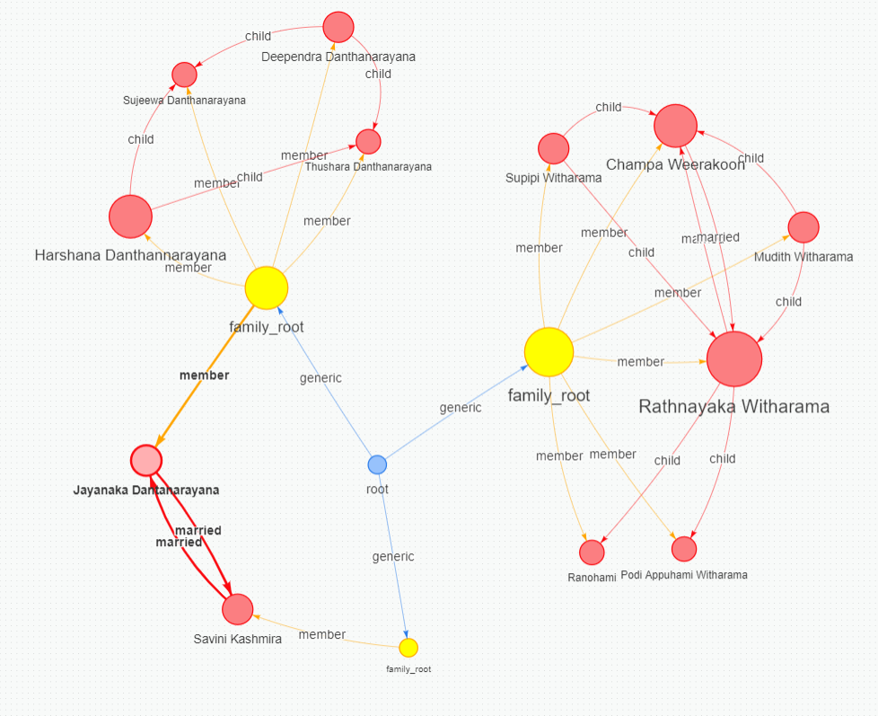

# Jaseci-Ancestry

This repository is for the Jaseci-Ancestry project, which uses Jaseci to build a family tree data structure and provides functionality to explore ancestry and descendants.

## New Features - Hobbies, Cars, Skills, and Blood Group

We have added four new features to the `family_tree.json` file to represent hobbies, cars, skills, and blood group for individuals in the family tree. These features were implemented to provide more information about individuals in the family tree and make it easier to find people with similar attributes. The four 'walkers' accomplish four different tasks.

  ###   1. hobby_cluster
This walker is used to create a dictionary which includes lists including people with mutual hobbies. The hobbies are added as keys on ad-hoc basis which does not limit the number of defined hobbies.
  ###   2. find_all_cars
This walker isused to create a list which includes all types of unique cars.
  ###   3. skill_cluster
This walker is used to create a dictionary which includes people with mutual skills. The skills are added as keys on ad-hoc basis which does not limit the number of defined skills.
  ###   4. possible_blood_donors
This walker is used to create a dictionary which includes lists of possible people to donate blood for each blood group. This includes all the blood groups and possible donors.

## Experience

Implementing new features was a relatively straightforward process. We updated the nodes to include new features modifying the graph.jac file. Then we defined four walkers to categorize individuals with similar attributes.

We found the Jaseci documentation to be very helpful in understanding how to work with the Jaseci framework. The documentation is well-organized and includes many examples that helped us to get started quickly.

## Demo

Here is a demo video showing how to use the new spouse feature:

https://user-images.githubusercontent.com/110921856/233441208-70209c4a-b86f-4fe5-96c2-d9c6779535d7.mp4

https://user-images.githubusercontent.com/110921856/233441226-ced66c4d-59c4-47c3-8a95-2506a7d1f35f.mp4

## Contributors

- Jayanaka Danthanarayana (Jayanaka-98)
- Savini Kashmira (savini98)
- Mudith Nirmala (mudithnirmala)
- Jehan Kulathunga (Jehan98)
- Shehan (shehancode)
